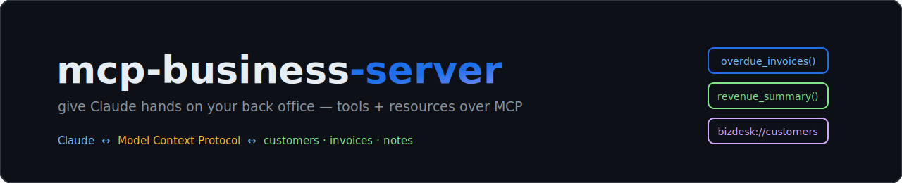

<p align="center"></p>

<p align="center">
  
  
  
  
</p>

> ✅ **Verified end-to-end** on Windows with local Ollama (`llama3.1`, `num_ctx=8192`) — every command below is from a real run.


**BizDesk MCP** is a Model Context Protocol server that gives Claude (or any
MCP client) structured, read-mostly access to a small-business back office:
customers, invoices, and account notes. Ask Claude *"who owes me money?"* and
it calls `overdue_invoices()` instead of guessing.

MCP is how AI assistants get real hands on real business data — and this repo
is the pattern I use for client systems, shrunk to a clean, runnable example.

## What it exposes

| Kind | Name | What Claude can do with it |
|---|---|---|
| tool | `list_customers(status)` | enumerate active/churned accounts |
| tool | `overdue_invoices(min_days_overdue)` | fetch late invoices, most overdue first |
| tool | `revenue_summary(year)` | monthly paid revenue + top customer |
| tool | `add_note(customer_name, note)` | append a timestamped account note |
| resource | `bizdesk://customers/{name}` | full customer card (profile + invoices + notes) |

Design choices worth copying: tools return **structured rows, not prose**;
the only write path (`add_note`) is append-only; and the server ships
`instructions` so the model knows the house rules before it calls anything.

## Quickstart

```bash
pip install -r requirements.txt
python seed.py        # creates bizdesk.db (8 customers, ~50 invoices)
```

**Claude Desktop** — add to `claude_desktop_config.json` (see `examples/`):

```json
{ "mcpServers": { "bizdesk": { "command": "python", "args": ["/abs/path/server.py"] } } }
```

**Claude Code** —

```bash
claude mcp add bizdesk -- python /abs/path/server.py
```

Restart the client, then try: *"Which invoices are more than 30 days overdue,
and draft a polite reminder for the worst one?"* — watch it chain
`overdue_invoices` → `bizdesk://customers/...` → a grounded draft.

## Point it at real data

`bizdesk.db` is plain SQLite. Swap the queries in `server.py` for your
Postgres/Airtable/QuickBooks layer and the MCP surface stays identical — the
client never knows the backend changed. That's the point of the protocol.

---

<p align="center">Built by <a href="https://github.com/syedahmad0786">Ahmad Bukhari</a> — AI &amp; Automation Architect · <i>agentic systems that run real businesses, not just demos</i></p>
